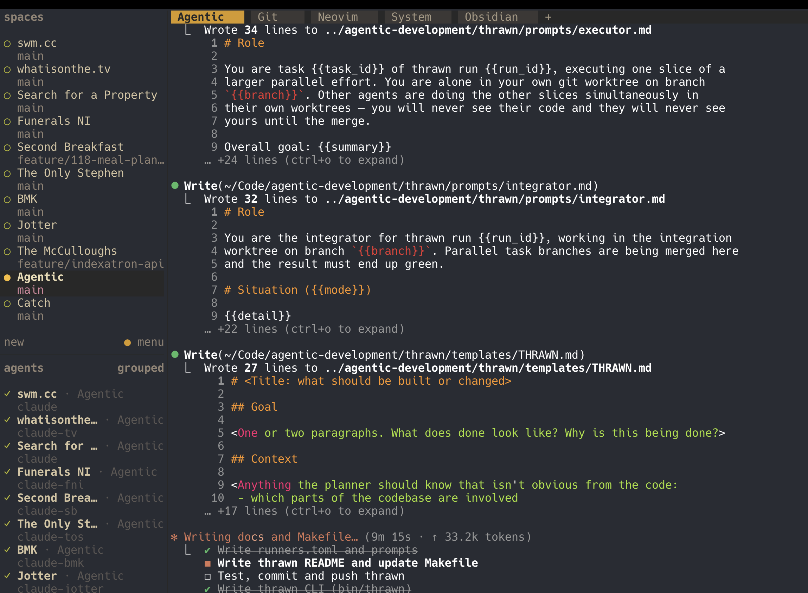

# ⚔ thrawn

*Plan deeply, execute in parallel.*


Give thrawn a ticket or a markdown brief. It:

1. **Deep-thinks** a plan with a strong model (fable) that explores your repo read-only
2. **Splits** the work into parallel tasks, each routed to the right agent/model for its complexity
3. **Spawns** one agent per task in an isolated git worktree — visible as herdr panes
4. **Merges** the task branches, resolves conflicts with an integrator agent, runs your checks
5. **Gates** shipping behind a one-time code — nothing is pushed until you've seen the green board
6. **Ships**: pushes the branch and opens the PR (gh) or MR (glab)

```
thrawn 123
        │
        ▼
   ┌─ deep think (fable, read-only) ──→ plan.json
   │
   ▼
   ┌──────────┬──────────┬──────────┐        herdr panes,
   │ t1 opus  │ t2 haiku │ t3 codex │  ←──   parallel, isolated
   │ worktree │ worktree │ worktree │        worktrees
   └────┬─────┴────┬─────┴────┬─────┘
        └──────────┼──────────┘
                   ▼
        merge → integrator agent → checks
                   ▼
            ALL GREEN  code: 482913
                   ▼
        thrawn ship gh-123 --code 482913
                   ▼
              push + PR/MR
```

## Install

From the repo root:

```bash
make setup-thrawn     # symlinks bin/thrawn into ~/.local/bin
```

Requires: `python3` ≥ 3.11, `git`, `claude` CLI. Optional: `herdr` (panes),
`gh`/`glab` (tickets + PRs), `codex`, `pi`, `ollama` (extra runners).

Tests: `make test` (pytest; uses fake runners + a local bare origin, no real
agents or network). `make lint` runs ruff.

## Usage

**New to thrawn? Read the [User Guide](USAGE.md)** — one scenario walked
end-to-end, from `thrawn recon` to the PR, including the failure paths.

```bash
thrawn 123                       # dispatch from issue #123 (gh/glab auto-detected)
thrawn briefs/dark-mode.md       # dispatch from a markdown brief
thrawn                           # dispatch from ./THRAWN.md
thrawn plan 123                  # plan only — review plan.json before executing
thrawn recon                     # cache a codebase brief (faster/cheaper planning)
thrawn watch gh-123              # execute a planned run / resume watching
thrawn status                    # the board (shows ship code when green)
thrawn ship gh-123 --code 482913 # push + open PR/MR
thrawn integrate gh-123          # retry merge/checks after a failure
thrawn runs                      # list runs in this repo
thrawn abort gh-123              # kill agents, delete worktrees + branches
```

Ctrl-C during a run is safe — agents keep working in their panes; resume the
orchestrator with `thrawn watch`.

## Recon — the context cache

Without a cache, every dispatch pays for the planner re-exploring your repo.
`thrawn recon` surveys the codebase once (read-only) and saves a dense brief
— purpose, stack, layout, key modules, conventions, test commands, gotchas —
to `.thrawn/recon.md`, pinned to the current commit.

Every later `thrawn <ticket>` injects that brief into the planner *and* every
worker agent, so they start oriented instead of exploring from scratch:
faster plans, fewer tokens.

You rarely need to run it by hand: dispatch auto-runs recon when a repo has
no cache yet (`auto_recon = true`). Staleness is measured in commits: within
`recon_max_age_commits` (default 50) the brief is trusted for orientation;
beyond it thrawn nags you to re-run `thrawn recon` and tells the models to
verify anything load-bearing. The cache is per-machine (it lives in
`.thrawn/`, which is git-excluded).

```toml
# .thrawn.toml — optional per-repo tuning
[thrawn]
recon_runner = "haiku"        # cheap surveys for a simple repo
recon_max_age_commits = 20    # stricter staleness on a fast-moving repo
```

## Ticket sources

thrawn works out where tickets live from the repo itself — no config:

1. `git remote get-url origin` is inspected
2. URL contains `github` → `gh issue view N --json title,body,labels`
3. URL contains `gitlab` → `glab issue view N` (JSON output when the
   installed glab supports it, plain text otherwise)
4. Neither → thrawn refuses the issue number and tells you to use a brief

The same detection drives shipping: GitHub repos get `gh pr create` (with
`Closes #N` in the body and a comment back on the issue), GitLab repos get
`glab mr create`.

## Briefs

Instead of a ticket, drop a `THRAWN.md` in the repo root (or pass any `.md`
path). Template in [templates/THRAWN.md](templates/THRAWN.md) — goal,
context, constraints, routing hints, out-of-scope.

## In action



## How it talks to you

| Channel | What you see |
|---------|--------------|
| **The board** | The dispatch pane becomes a live status board: one line per task with runner + state (`○ pending ◐ running ● done ✖ failed`), integration progress, and the ship code when green. Also on demand via `thrawn status`. |
| **The run tab** | Each run gets one tab (`⚔ gh-123`) in the workspace you dispatched from, with a stacked pane per agent — workers and integrators side by side, streaming live. Herdr's working/idle indicators apply to each pane. |
| **Notifications** | `herdr notification show` fires on the big transitions: task failure, checks failing, ALL GREEN, shipped. |
| **Logs** | Everything is tee'd to `.thrawn/runs/<run>/` — `task-*.log`, `integrator-*.log`, `planner-raw.txt` — so nothing is lost when a pane closes. |
| **State** | `state.json` per run is the source of truth (`thrawn runs` summarises it). |

## Runner routing

The planner routes each task by complexity. Defaults in
[runners.toml](runners.toml):

| Runner | Command | Used for |
|--------|---------|----------|
| `fable-plan` | `claude --model claude-fable-5 --permission-mode plan` | planning only (read-only) |
| `opus` | `claude --model opus` | high-complexity, architectural |
| `haiku` | `claude --model haiku` | mechanical, well-specified |
| `codex` | `codex exec --full-auto` | focused codegen |
| `pi` | `pi` | alternative executor |
| `local` | `ollama run qwen2.5-coder` | trivial isolated snippets |

Config precedence (later wins):

1. `thrawn/runners.toml` (defaults, this repo)
2. `~/.config/thrawn/runners.toml` (your machine)
3. `<repo>/.thrawn.toml` (per-project — e.g. override `[checks] commands`)

## The ship gate

Worker agents run with `--dangerously-skip-permissions` — safe because each
is jailed in its own worktree on its own branch; worst case is
`thrawn abort`. The trade-off is a hard gate at the other end: **nothing is
ever pushed automatically.** When integration goes green, thrawn generates a
one-time 6-digit code shown only on the status board. Shipping requires
typing it back:

```bash
thrawn ship gh-123 --code 482913
```

Seeing the green board *is* the second factor.

## State

Everything lives in `<repo>/.thrawn/` (auto-added to `.git/info/exclude`):

```
.thrawn/
├── runs/<run-id>/
│   ├── plan.json           # the battle plan
│   ├── state.json          # phases, task statuses, ship code
│   ├── planner-raw.txt     # raw planner output
│   ├── task-t1.log         # per-task agent output
│   └── task-t1.exit        # per-task exit codes
└── worktrees/<run-id>/
    ├── t1/ t2/ …           # task worktrees
    └── _integration/       # merge target
```

## Without herdr

thrawn prefers herdr (`tab create` + `agent start` per task) but falls back
to detached background processes when herdr isn't running — same behaviour,
just no live panes. Force fallback with `THRAWN_NO_HERDR=1`.
